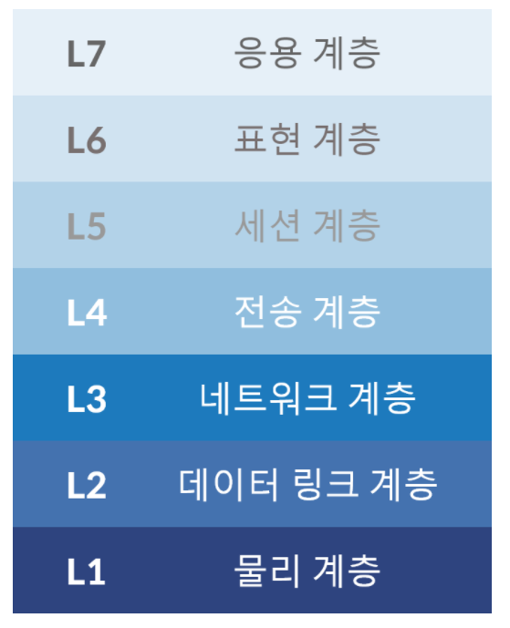

# Load Balancer 란?

서버에 가해지는 부하(=로드)를 분산(=밸런싱)해주는 장치 또는 기술을 말한다.
클라이언트와 서버풀 사이에 위치하며, 한 대의 서버로 부하가 집중되지 않도록 트래픽을 관리해 각각의 서버가 최적의 퍼포먼스를 보일 수 있도록 한다.
만약 Scale-out의 방식으로 서버를 증설하기로 결정했다면 여러 대릐 서버로 트래픽을 균등하게 분산해주는 로드밸런싱이 반드시 필요하다.

#### Scale-up
Server가 더 빠르게 동작하기 위해 하드웨어 성능을 올리는 방법.

#### Scale-out
하나의 Server 보다는 여러대의 Server가 나눠서 일을 하는 방법

### OSI 7계층
네트워크 통신은 크게 일곱 가지의 계층(OSI 7 Layers, 개방형 통신을 위한 국제 표준 모델)으로 나뉜다.
각각의 계층(Layer)이 L1/L2/L3...L7에 해당한다. 상위 계층에서 사용되는 장비는 하위 계층의 장비가 갖고 있는 기능을 모두 가지고 있으며,
상위 계층으로 갈수록 더욱 정교한 로드밸런싱이 가능하다.

#### OSI 7 계층 프로토콜

1. 물리계층
 - X (랜선 / 허브 / 리피터등의 디바이스만 존재)
2. 데이터 링크 계층
 - Ethernet, Token Ring, FDDI
3. 네트워크 계층
 - IP, ICMP, ARP, RARP
4. 전송 계층
 - TCP, UDP
5. 세션 계층
 - NetBIOS, SAP, SDP, NWLink
6. 표현 계층
 - ASCII, MPEG, JPEG, MIDI
7. 응용 계층
 - HTTP, FTP, SMTP

### L4(Transport Layer)
주로 Round Robin 방식을 사용하며, 네트워크 계층(IP, IPX)이나 트랜스포트 계층(TCP, UDP)의 정보를 바탕으로 로드를 분산 시킨다.

### L7(Application Layer)
애플리케이션 계층(HTTP, FTP, SMTP)에서 로드를 분산하기 때문에 HTTP 헤더, 쿠키 등과 같은 사용자의 요청을 기준으로
특정 서버에 트래픽을 분산하는 것이 가능하다.
쉽게 말해 패킷의 내용을 확인하고 그 내용에 따라 로드를 특정 서버에 분배하는 것이 가능한 것이다.
부하를 분산시키거나, HTTP 헤더의 쿠키값에 따라 부하를 분산하는 등 클라이언트의 요청을 보다 세분화해 서버에 전달할 수 있다.
또한 L7 로드벨런서의 경우 특정한 패턴을 지닌 바이러스를 감지해 네트워크를 보호할 수 있으며 DoS/DDoS와 같은 비정상적인 트래픽을
필터링할 수 있어 네트워크 보안 분야에서 활용된다.

### L4 vs L7

- L4
  - 네트워크 계층 : Layer4(전송계층 / Transport layer)
  - 특징 : TCP/UDP 포트 정보를 바탕으로 한다.
  - 장점
     - 데이터 안을 들여다보지 않고 패킷 레벨에서만 로드를 분산하기 때문에 속도가 빠르고 효율이 높음
     - 데이터의 내용을 복호화할 필요가 없기에 안전함.
     - L7 로드벨런서보다 가격이 저렴함
  - 단점
     - 패킷의 내용을 살펴볼 수 없기 때문에 섬세한 라우팅이 불가능함.
     - 사용자의 IP가 수시로 바뀌는 경우라면 연속적인 서비스를 제공하기 어려움
    
- L7
  - 네트워크 계층 : Layer7(응용계층 / Application layer)
  - 특징 : TCP/UDP 정보는 물론 HTTP의 URL, FTP의 파일명, 쿠키 정보등을 바탕으로 함
  - 장점
     - 상위 계층에서 로드를 분산하기 때문에 훨씬 더 섬세함
     - 캐싱 기능을 제공함
     - 비정상적인 트래픽을 사전에 필터링할 수 있어 서비스 안정성이 높음
  - 단점
     - 패킷의 내용을 복호화해야 하기에 더 높은 비용을 지불해야 함
     - 클라이언트가 로드밸런서와 인증서를 공유해야하기 때문에 공격자가 로드벨런서를 통해서 클라이언트에 데ㅔ이터에 접근할 보안 상의 위험성이 존재함
    
### 로드밸런서 알고리즘
- Round Robin(순자 방식) : 요청을 순서대로 각 서버에 균등하게 분배하는 방식, 서버 커넥션 수나 응답시간에 상관 없이 모든 서버를 동일하게 처리, 다른 알고리즘에 비해서 가장 빠르다.
- IP Hash (IP 해시 방식) : 클라이언트 IP 주소를 특정 서버로 매핑하여 요청을 처리하는 방식, 사용자의 IP를 해싱해(Hashing, 임의의 길이를 지닌 데이터를 고정된 길이의 데이터로 매핑하는 것, 또는 그러한 함수) 로드를 분배하기 때문에 사용자가 항상 동일한 서버로 연결되는 것을 보장한다.
- Least Connection (최소 접속 방식) : 서버에 연결되어 있는 Connection 개수만 갖고 단순 비교하여 가장 적은곳에 연결
- Weighted Least Connections (가중치 최소 접속방식) : 서버에 부여된 Weight 값을 기반으로 Connection 수의 개수와 같이 고려하여 할당
- Fastest Response Time (응답 시간 방식) : 가장 빨리 응답하는 서버에 이용자 요구를 연결하는 방법. 응답시간은 각 서버가 패킷 형태의 요구를 송수신하는데 걸리는 시간을 측정한 것이다.
- Adaptive (최소 대기 방식) : Open 또는 Pending 커넥션을 적게 가지고 있는 서버로 네트워크 커넥션 방향을 지정한다. Pending 커넥션은 Full TCP HandShake를 완성하지 않는 것으로, 이것은 초당 클라이언트 Thread의 수가 증가할 때 더욱 잘 수행된다.

### ref
 - [L4 load balancer vs L7 load balancer](https://velog.io/@makeitcloud/%EB%9E%80-L4-load-balancer-vs-L7-load-balancer-%EB%9E%80)