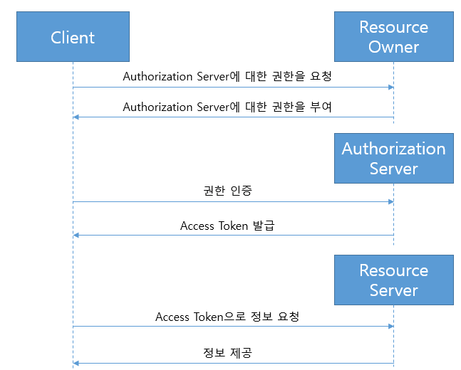
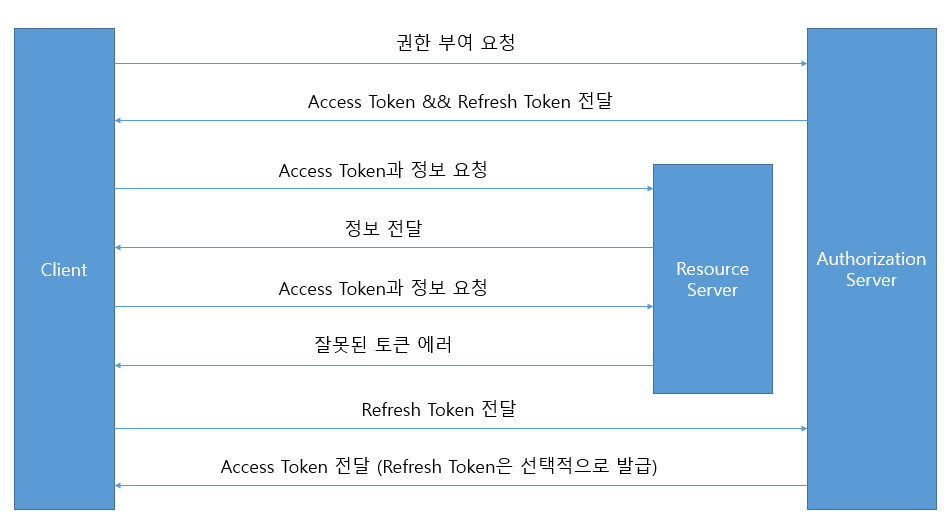

# OAuth 2.0

### Roles
- Resource Owner(The User)
  - 보호된 자원에 대한 접근 권한을 부여할 수 있는 엔티티 
  - 리소스 오너가 개인인 경우, 최종 사용자라고 한다.
    
- Resource Server(The API Server)
  - ```Access Token```을 사용하여 보호 자원 요청을 수락하고 응답 할 수 있는 보호 자원을 호스팅하는 서버
    
- Client
  - ```Resource Owner```를 대신하여 권한을 부여하여 보호된 리소스 요청을 하는 응용 프로그램
    
- Authorization Server
  - ```Access Token```을 발급하는 서버
  - ```Resource Owner```를 성공적으로 인증하고 권한을 얻은 후 서버가 클라이언트에 액세스 토큰을 발행
    
### Protocol Flow



1. 클라이언트는 ```Resource owner```로 부터 ```Authorization```(인가/권한 부여)를 요청한다. 
   ```Authorization```요청은 ```Resource Owner```에게 직접 요청하거나 중개자로서 인증 서버를 통해 간접적으로 이루어 질수 있다.
2. ```Client```는 스펙에 정의된 네 가지 권한 중 하나를 사용하거나 확장 권한 타입을 사용하여 표시되는 Resource Owner의 권한을 나타내는 
   자격증명서인 권한 부여 권한을 받는다. 권한 부여 유형은 ```Client```가 권한 부여를 요청하는데 사용하는 방법 및 ```Authorization server```
   가 지원하는 유형에 따라 다르다.
3. ```Client```는 ```Authorization Server```로 인증하고, 권한 부여를 제시하여 ```Access Token```을 요청한다.
4. ```Authorization Server```는 클라이언트를 인증하고 권한 부여를 검토하고, 유효하면 ```Access Token```을 발행한다.
5. ```Client```는 리소스 서버에서 보호된 리소스를 요청하고 ```Access Token```을 제시하여 인증한다.
6. ```Resource Server```는 ```Access Token```을 검증하고, 유효하면 요청을 제공한다.

### Authorization Grant

```Client```가 ```Access Token```을 얻기 위한 인증 권한을 획득하는 방법에는 4가지가 존재한다.

1. ```Authorization Code```
    - ```Resource Owner```가 ```Authorization Server```에서 인증을 하고 나면, ```Authorization Server```는 ```Resource Owner```를
      ```Client```로 리다이렉트 하면서 코드를 하나 발급해준다.
      ```Client```는 이 코드를 획득한 후, 다시 ```Authorization Server```에 이 코드를 이용해서 ```Access Token```과 ```Refresh Token```을 획득한다.
      ```Client```가 ```Resource Owner```로부터 권한을 획득하는 과정을 ```Resource Owner```가 ```Authorization Server```와의 인증작업을 통해
      그 결괏값을 ```Client```에게 전달하는 방식이 기본이다. 이는 HTTP의 리다이렉션등의 기능을 통해 손쉽게 구현될 수 있다.
      

2. ```Implicit```
    - ```Implicit``` 방식은 자바 스크립트와 같은 스크립팅 언어를 사용하여
      브라우저에서 구현된 ```Client```에 최적화된 단순화된 ```Authorization Code``` 흐름이다.
      ```Client```에 ```Authorization Code```를 발행하는 대신에 직접 ```Access Token```을 발행한다.
      이 방식은 중간 인증 없이 ```Access Token```을 발행한다.   


3. ```Resource Owner Password Credentials```
    - ```Resource Owner Password Credentials```은 ```Access Token```을 얻기 위한 권한 부여로 직접 사용할 수 있다.
    이 증명 방식은 ```Resource Owner```와 ```Client```가 높은 수준의 신뢰가 있고 다른 권한 부여 유형을 사용할 수 없을 경우에만 사용해야 한다.
   

4. ```Client Credentials```
    - 이 방식은 권한 범위가 ```Client```의 제어 하에 있는 보호된 자원으로 제한되거나 이전에 ```Authorization Server```와 함께 
      배열된 보호된 리소스 권한 부여에 사용할 수 있다.

### Token



1. ```Client```는 ```Authorization Server```로 인증하고 권한 부여를 제공하여 ```Access Token```을 요청한다.
2. ```Authorization Server```는 ```Client```와 올바른 권한 부여를 확인하고 올바르다면 ```Access Token```과 ```Refresh Token```을 발행한다.
3. ```Client```는 ```Resource Server```에 ```Access Token```과 함께 보호된 리소스를 요청한다.
4. ```Resource Server```는 ```Access Token```을 검증하고 올바르다면 보호된 리소스를 ```Client```에 전달한다.
5. 만약 3번에서 만료된 ```Access Token```과 함께 보호된 리소스를 요청하면
6. ```Resource Server```에서 만료된 ```Access Token```을 검사하고 invalid token error를 보낸다.
7. ```Client```는 ```Authorization Server```에 ```Refresh Token```과 함께 새로운 ```Access Token```을 요청하며 ```Client``` 인증 요청 사항은 ```Client``` 타입과 ```Authorization Server```정책을 기반으로 한다. 
8. ```Authorization Server```는 ```Client```와 올바른 ```Refresh Token```를 확인하고 올바르다면 ```Access Token```(```Refresh Token```은 선택적으로)을 발행한다.

#### Access Token
- ```Access Token```은 보호된 리소스에 접근하는데 사용되는 자격 증명이다.
- ```Access Token```은 클라이언트에 발행된 권한을 나타내는 문자열이다.
- ```Access Token```은 ```Resource Owner```가 부여하고 ```Resource Server```와 ```Authorization Server```가 시행하는 특정 권한 범위 및 액세스 기간을 나타낸다.

#### Refresh Token
- ```Refresh Token```은 ```Access Token```을 얻는데 사용되는 자격증명이다.
- ```Refresh Token```은 ```Authorization Server```에 의해 ```Client```에 발행되며 현재 ```Access Token```이 유효하지 않거나 만료 될 때,
 새 ```Access Token```을 얻거나 범위가 동일하거나 적은 추가 ```Access Token```을 얻는데 사용된다.

### ref
 - [OAuth2.0 공식 문서](https://oauth.net/2/)
 - [[RFC 6749] #02. Introduction](https://velog.io/@undefcat/RFC-6749-02.-Introduction)
 - [[OAuth2.0] OAuth 2.0 용어 정리](https://gintrie.tistory.com/37)